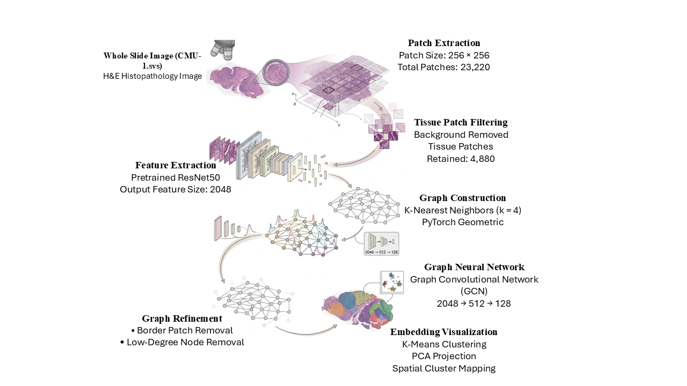
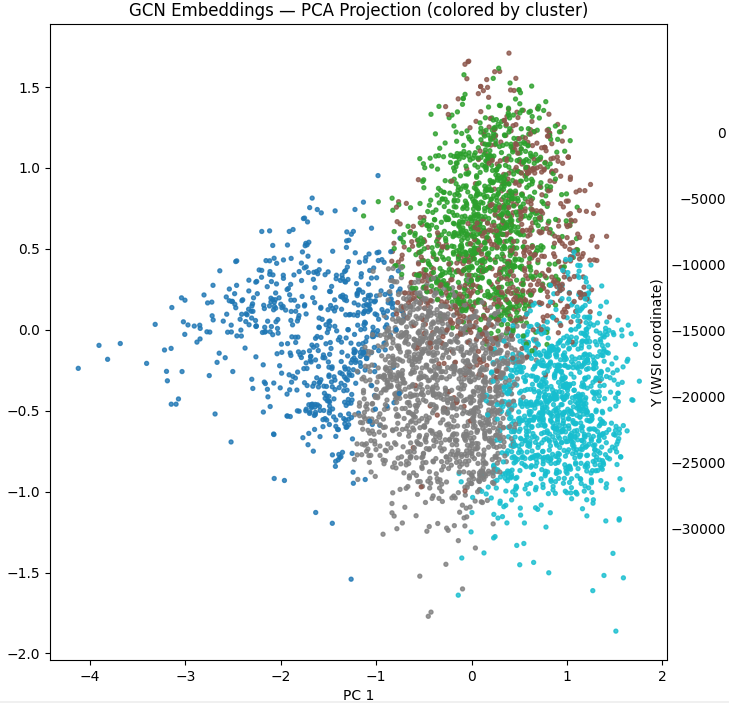
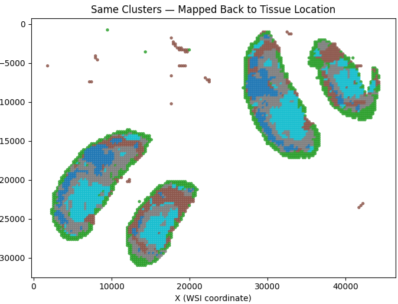

# SpatialOmicsGNN

## About the Project

This project is a simplified implementation of the SpatialOmicsGNN pipeline for analyzing Whole Slide Images (WSIs). The main goal of this project is to understand how Graph Neural Networks (GNNs) can be used to learn spatial relationships between tissue patches in histopathology images.

In this project, I used the CMU-1 Whole Slide Image, extracted tissue patches, generated deep features using ResNet50, built a spatial graph using K-Nearest Neighbors (KNN), applied a Graph Convolutional Network (GCN), and visualized the learned embeddings using PCA and K-Means clustering.


## Project Architecture



## What I Implemented

- Read the Whole Slide Image (.svs) using OpenSlide
- Extract 256 × 256 image patches
- Remove background patches
- Extract 2048-dimensional features using a pretrained ResNet50 model
- Generate spatial coordinates for each tissue patch
- Build a KNN graph using patch coordinates
- Refine the graph by removing border patches and isolated nodes
- Train a Graph Convolutional Network (GCN)
- Visualize the learned embeddings using PCA
- Map clustered patches back to their original tissue locations


## Project Workflow

1. Read the Whole Slide Image.
2. Extract image patches from the slide.
3. Remove background patches and keep only tissue patches.
4. Extract deep features using ResNet50.
5. Build a spatial graph using KNN.
6. Refine the graph by removing noisy nodes.
7. Train a Graph Convolutional Network.
8. Cluster the learned embeddings using K-Means.
9. Visualize the embeddings with PCA.
10. Map the clusters back onto the original tissue image.


## Dataset

- Dataset: CMU-1 Whole Slide Image
- Image Type: H&E Histopathology Image
- File Format: `.svs`


## Results

### PCA Visualization



This figure shows the PCA projection of the node embeddings learned by the GCN. Similar tissue patches are grouped together into clusters.


### Spatial Cluster Mapping



This visualization maps the cluster labels back to the original tissue locations, showing how similar tissue regions are grouped together.


## Technologies Used

- Python
- PyTorch
- PyTorch Geometric
- OpenSlide
- OpenCV
- NumPy
- Pandas
- Scikit-learn
- NetworkX
- Matplotlib


## How to Run

## How to Run

1. Clone this repository.

2. Install the required packages.

```bash
pip install -r requirements.txt


Run the scripts in the following order:

```bash
python src/read_wsi.py
python src/extract_patches.py
python src/filter_patches.py
python src/feature_extraction.py
python src/create_edges.py
python src/create_graph.py
python src/GCN_layers.py
python src/final_vis.py
```


## What I Learned

Through this project, I learned:

- How Whole Slide Images are processed.
- How to extract image patches from WSIs.
- How pretrained CNN models can be used for feature extraction.
- How spatial graphs are constructed using KNN.
- How Graph Convolutional Networks learn relationships between neighboring tissue patches.
- How to visualize high-dimensional embeddings using PCA and K-Means clustering.


## Future Improvements

- Use multiple Whole Slide Images.
- Try Graph Attention Networks (GAT).
- Perform tissue classification.
- Integrate spatial transcriptomics data.
- Improve graph construction methods.

## Conclusion

This project helped me understand the complete workflow of analyzing Whole Slide Images using Graph Neural Networks. Through this implementation, I gained practical experience in image preprocessing, feature extraction, graph construction, graph neural networks, and visualization techniques used in digital pathology.

## Author

**Sharguru Nathan**

B.E. Computer Science and Engineering